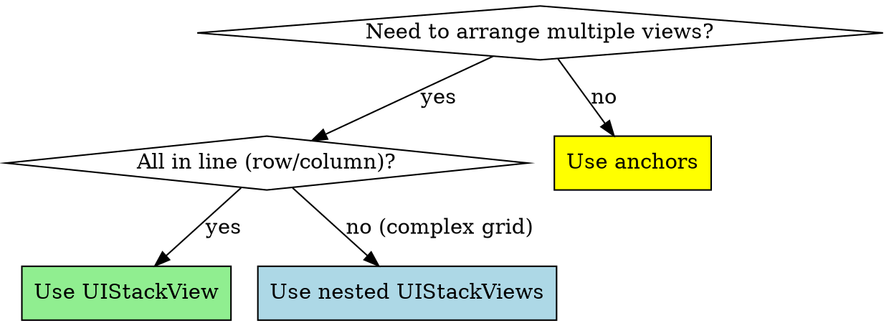

# Programmatic UIKit Layout with Auto Layout

## Overview

**Programmatic UIKit layout with anchors provides type-safe, maintainable UI code used by production apps at scale.** Stack views solve 50%+ of layout problems, anchors provide compile-time safety, design systems ensure consistency.

**Core principle:** Anchors-only (no Visual Format Language), stack-first composition, reusable components with centralized spacing/colors.

## Foundation Setup

### Step 1: Disable Storyboards

**Remove Main.storyboard:**
1. Delete Main.storyboard file
2. In Info.plist, delete "Main storyboard file base name" entry
3. Delete "Storyboard Name" in Target → Info → Custom iOS Target Properties

**Configure SceneDelegate:**
```swift
class SceneDelegate: UIResponder, UIWindowSceneDelegate {
    var window: UIWindow?

    func scene(_ scene: UIScene, willConnectTo session: UISceneSession, options connectionOptions: UIScene.ConnectionOptions) {
        guard let windowScene = (scene as? UIWindowScene) else { return }

        window = UIWindow(windowScene: windowScene)
        window?.rootViewController = MainViewController()
        window?.makeKeyAndVisible()
    }
}
```

### Step 2: Essential UIView Setup

**CRITICAL:** Every view needs `translatesAutoresizingMaskIntoConstraints = false`

```swift
// ❌ WRONG: Constraints conflict with autoresizing mask
let label = UILabel()
view.addSubview(label)
label.topAnchor.constraint(equalTo: view.topAnchor).isActive = true
// Runtime error: conflicting constraints

// ✅ CORRECT: Disable autoresizing mask
let label = UILabel()
label.translatesAutoresizingMaskIntoConstraints = false
view.addSubview(label)
label.topAnchor.constraint(equalTo: view.topAnchor).isActive = true
```

**Rule:** Set `translatesAutoresizingMaskIntoConstraints = false` BEFORE adding constraints.

## Layout Anchors (Preferred Method)

### Why Anchors Over NSLayoutConstraint

| Feature | Layout Anchors | NSLayoutConstraint |
|---------|----------------|-------------------|
| Type safety | ✅ Compile-time checks | ❌ Runtime errors |
| Readability | ✅ Fluent API | ❌ Verbose initializer |
| Error prevention | ✅ Can't mix X/Y axes | ❌ Easy to make mistakes |

```swift
// ❌ WRONG: NSLayoutConstraint (verbose, error-prone)
NSLayoutConstraint(
    item: label,
    attribute: .top,
    relatedBy: .equal,
    toItem: view,
    attribute: .top,
    multiplier: 1.0,
    constant: 20
).isActive = true

// ✅ CORRECT: Layout anchors (concise, type-safe)
label.topAnchor.constraint(equalTo: view.topAnchor, constant: 20).isActive = true
```

### Anchor Types

**X-axis:** `leadingAnchor`, `trailingAnchor`, `leftAnchor`, `rightAnchor`, `centerXAnchor`
**Y-axis:** `topAnchor`, `bottomAnchor`, `centerYAnchor`
**Dimension:** `widthAnchor`, `heightAnchor`

**Type safety:**
```swift
// ✅ Compiles: Same axis
label.leadingAnchor.constraint(equalTo: view.leadingAnchor)

// ❌ Compiler error: Mixed axes
label.leadingAnchor.constraint(equalTo: view.topAnchor)  // Won't compile!
```

### Basic Constraint Patterns

**Pin to edges:**
```swift
label.translatesAutoresizingMaskIntoConstraints = false
view.addSubview(label)

NSLayoutConstraint.activate([
    label.topAnchor.constraint(equalTo: view.topAnchor, constant: 20),
    label.leadingAnchor.constraint(equalTo: view.leadingAnchor, constant: 20),
    label.trailingAnchor.constraint(equalTo: view.trailingAnchor, constant: -20),
    label.bottomAnchor.constraint(equalTo: view.bottomAnchor, constant: -20)
])
```

**Center with size:**
```swift
label.translatesAutoresizingMaskIntoConstraints = false
view.addSubview(label)

NSLayoutConstraint.activate([
    label.centerXAnchor.constraint(equalTo: view.centerXAnchor),
    label.centerYAnchor.constraint(equalTo: view.centerYAnchor),
    label.widthAnchor.constraint(equalToConstant: 200),
    label.heightAnchor.constraint(equalToConstant: 50)
])
```

**Aspect ratio:**
```swift
imageView.translatesAutoresizingMaskIntoConstraints = false
view.addSubview(imageView)

NSLayoutConstraint.activate([
    imageView.topAnchor.constraint(equalTo: view.safeAreaLayoutGuide.topAnchor),
    imageView.leadingAnchor.constraint(equalTo: view.leadingAnchor),
    imageView.trailingAnchor.constraint(equalTo: view.trailingAnchor),
    imageView.heightAnchor.constraint(equalTo: imageView.widthAnchor, multiplier: 9.0/16.0)  // 16:9
])
```

## Safe Area Layout Guide

**CRITICAL:** Use `safeAreaLayoutGuide` for modern iPhones (notch, dynamic island).

```swift
// ❌ WRONG: Content hidden behind notch
label.topAnchor.constraint(equalTo: view.topAnchor)

// ✅ CORRECT: Respects safe area
label.topAnchor.constraint(equalTo: view.safeAreaLayoutGuide.topAnchor)
```

**Standard pattern:**
```swift
NSLayoutConstraint.activate([
    contentView.topAnchor.constraint(equalTo: view.safeAreaLayoutGuide.topAnchor),
    contentView.leadingAnchor.constraint(equalTo: view.leadingAnchor),
    contentView.trailingAnchor.constraint(equalTo: view.trailingAnchor),
    contentView.bottomAnchor.constraint(equalTo: view.safeAreaLayoutGuide.bottomAnchor)
])
```

## Stack Views (Stack-First Philosophy)

**CRITICAL:** Stack views solve 50%+ of layout problems. Use them liberally.



### Basic Stack View

```swift
let stackView = UIStackView()
stackView.axis = .vertical  // or .horizontal
stackView.spacing = 16
stackView.alignment = .fill  // .leading, .center, .trailing
stackView.distribution = .fill  // .fillEqually, .equalSpacing, etc.
stackView.translatesAutoresizingMaskIntoConstraints = false

view.addSubview(stackView)
NSLayoutConstraint.activate([
    stackView.topAnchor.constraint(equalTo: view.safeAreaLayoutGuide.topAnchor, constant: 20),
    stackView.leadingAnchor.constraint(equalTo: view.leadingAnchor, constant: 20),
    stackView.trailingAnchor.constraint(equalTo: view.trailingAnchor, constant: -20)
])

stackView.addArrangedSubview(titleLabel)
stackView.addArrangedSubview(subtitleLabel)
stackView.addArrangedSubview(button)
```

### Nested Stack Views (Complex Layouts)

```swift
// Horizontal stack with icon + labels
let horizontalStack = UIStackView()
horizontalStack.axis = .horizontal
horizontalStack.spacing = 12
horizontalStack.alignment = .center

let iconImageView = UIImageView(image: UIImage(systemName: "star.fill"))
iconImageView.widthAnchor.constraint(equalToConstant: 24).isActive = true
iconImageView.heightAnchor.constraint(equalToConstant: 24).isActive = true

// Vertical stack for title + subtitle
let verticalStack = UIStackView()
verticalStack.axis = .vertical
verticalStack.spacing = 4

verticalStack.addArrangedSubview(titleLabel)
verticalStack.addArrangedSubview(subtitleLabel)

horizontalStack.addArrangedSubview(iconImageView)
horizontalStack.addArrangedSubview(verticalStack)

view.addSubview(horizontalStack)
// Pin horizontalStack with anchors
```

### Spacer Views

```swift
// Add flexible spacing in stack view
let spacer = UIView()
spacer.setContentHuggingPriority(.defaultLow, for: .vertical)
stackView.addArrangedSubview(spacer)

// Pattern: Button at bottom
stackView.addArrangedSubview(titleLabel)
stackView.addArrangedSubview(descriptionLabel)
stackView.addArrangedSubview(spacer)  // Pushes button to bottom
stackView.addArrangedSubview(button)
```

## Design System Pattern

### Theme (Centralized Spacing/Colors)

```swift
enum Theme {
    enum Spacing {
        static let tiny: CGFloat = 4
        static let small: CGFloat = 8
        static let medium: CGFloat = 16
        static let large: CGFloat = 24
        static let xLarge: CGFloat = 32
    }

    enum CornerRadius {
        static let small: CGFloat = 4
        static let medium: CGFloat = 8
        static let large: CGFloat = 12
        static let xLarge: CGFloat = 16
    }

    enum Colors {
        static let primary = UIColor.systemBlue
        static let secondary = UIColor.systemGray
        static let background = UIColor.systemBackground
        static let text = UIColor.label
        static let textSecondary = UIColor.secondaryLabel
    }
}

// Usage:
stackView.spacing = Theme.Spacing.medium
button.layer.cornerRadius = Theme.CornerRadius.medium
label.textColor = Theme.Colors.text
```

### Reusable Components

**Card View:**
```swift
final class CardView: UIView {
    private let containerView = UIView()

    override init(frame: CGRect) {
        super.init(frame: frame)
        setupView()
    }

    required init?(coder: NSCoder) {
        fatalError("init(coder:) not implemented")
    }

    private func setupView() {
        backgroundColor = Theme.Colors.background
        layer.cornerRadius = Theme.CornerRadius.large
        layer.shadowColor = UIColor.black.cgColor
        layer.shadowOpacity = 0.1
        layer.shadowOffset = CGSize(width: 0, height: 2)
        layer.shadowRadius = 4

        containerView.translatesAutoresizingMaskIntoConstraints = false
        addSubview(containerView)

        NSLayoutConstraint.activate([
            containerView.topAnchor.constraint(equalTo: topAnchor, constant: Theme.Spacing.medium),
            containerView.leadingAnchor.constraint(equalTo: leadingAnchor, constant: Theme.Spacing.medium),
            containerView.trailingAnchor.constraint(equalTo: trailingAnchor, constant: -Theme.Spacing.medium),
            containerView.bottomAnchor.constraint(equalTo: bottomAnchor, constant: -Theme.Spacing.medium)
        ])
    }

    func setContent(_ view: UIView) {
        containerView.subviews.forEach { $0.removeFromSuperview() }
        view.translatesAutoresizingMaskIntoConstraints = false
        containerView.addSubview(view)

        NSLayoutConstraint.activate([
            view.topAnchor.constraint(equalTo: containerView.topAnchor),
            view.leadingAnchor.constraint(equalTo: containerView.leadingAnchor),
            view.trailingAnchor.constraint(equalTo: containerView.trailingAnchor),
            view.bottomAnchor.constraint(equalTo: containerView.bottomAnchor)
        ])
    }
}
```

**Primary Button:**
```swift
final class PrimaryButton: UIButton {
    override init(frame: CGRect) {
        super.init(frame: frame)
        setupButton()
    }

    required init?(coder: NSCoder) {
        fatalError("init(coder:) not implemented")
    }

    private func setupButton() {
        backgroundColor = Theme.Colors.primary
        setTitleColor(.white, for: .normal)
        layer.cornerRadius = Theme.CornerRadius.medium
        titleLabel?.font = .systemFont(ofSize: 16, weight: .semibold)
        contentEdgeInsets = UIEdgeInsets(
            top: Theme.Spacing.medium,
            left: Theme.Spacing.large,
            bottom: Theme.Spacing.medium,
            right: Theme.Spacing.large
        )
    }
}
```

## Layout Priority & Content Hugging/Compression

### Content Hugging Priority

**Controls how much view resists growing beyond intrinsic content size.**

```swift
// Default: 250 (low)
// Higher priority = resists growing more

label.setContentHuggingPriority(.required, for: .horizontal)  // 1000
button.setContentHuggingPriority(.defaultLow, for: .horizontal)  // 250

// Result: Button expands, label stays at intrinsic width
```

### Content Compression Resistance

**Controls how much view resists shrinking below intrinsic content size.**

```swift
// Default: 750 (high)
// Higher priority = resists shrinking more

titleLabel.setContentCompressionResistancePriority(.required, for: .horizontal)  // 1000
subtitleLabel.setContentCompressionResistancePriority(.defaultLow, for: .horizontal)  // 250

// Result: Subtitle truncates before title
```

**Common pattern: Label in horizontal stack**
```swift
let stackView = UIStackView()
stackView.axis = .horizontal
stackView.spacing = 8

let label = UILabel()
label.text = "Very long text that might truncate..."
label.setContentHuggingPriority(.defaultLow, for: .horizontal)  // Allows expansion
label.setContentCompressionResistancePriority(.required, for: .horizontal)  // Prevents shrinking

let button = UIButton()
button.setContentHuggingPriority(.required, for: .horizontal)  // Stays at intrinsic width

stackView.addArrangedSubview(label)
stackView.addArrangedSubview(button)
```

## Common Mistakes

| Mistake | Reality | Fix |
|---------|---------|-----|
| "Forgot translatesAutoresizingMaskIntoConstraints = false" | Conflicting constraints, layout breaks | Set to false BEFORE constraints |
| "Using view.topAnchor instead of safeAreaLayoutGuide" | Content hidden behind notch | Always use safeAreaLayoutGuide |
| "Individual .isActive = true for each constraint" | Verbose, inefficient | Use NSLayoutConstraint.activate([]) |
| "Visual Format Language is easier" | VFL is deprecated, error-prone | Use anchors only |
| "Don't need content hugging/compression" | Labels truncate unexpectedly, buttons expand wrong | Set priorities explicitly |
| "Adding subview after constraints" | Crash: view not in hierarchy | addSubview() BEFORE activate() |

## Debugging Layout Issues

### Ambiguous Layout

```swift
// In UIViewController viewDidLoad or custom view init
#if DEBUG
DispatchQueue.main.async {
    if self.view.hasAmbiguousLayout {
        print("⚠️ Ambiguous layout detected")
        self.view.exerciseAmbiguityInLayout()  // Animate between valid layouts
    }
}
#endif
```

### Constraint Conflicts

**Runtime error:** "Unable to simultaneously satisfy constraints..."

**Debug:**
1. Read error message for constraint IDs
2. Add identifiers to constraints:
```swift
let constraint = label.topAnchor.constraint(equalTo: view.topAnchor)
constraint.identifier = "label-top"
constraint.isActive = true
```

3. Lower priority of less important constraint:
```swift
let constraint = label.heightAnchor.constraint(equalToConstant: 50)
constraint.priority = .defaultHigh  // 750 instead of 1000
constraint.isActive = true
```

## Quick Reference

**Basic setup:**
```swift
let view = UIView()
view.translatesAutoresizingMaskIntoConstraints = false
parentView.addSubview(view)

NSLayoutConstraint.activate([
    view.topAnchor.constraint(equalTo: parentView.safeAreaLayoutGuide.topAnchor),
    view.leadingAnchor.constraint(equalTo: parentView.leadingAnchor),
    view.trailingAnchor.constraint(equalTo: parentView.trailingAnchor),
    view.bottomAnchor.constraint(equalTo: parentView.bottomAnchor)
])
```

**Stack view:**
```swift
let stack = UIStackView()
stack.axis = .vertical
stack.spacing = Theme.Spacing.medium
stack.addArrangedSubview(view1)
stack.addArrangedSubview(view2)
```

**Design system:**
```swift
view.backgroundColor = Theme.Colors.background
stackView.spacing = Theme.Spacing.medium
button.layer.cornerRadius = Theme.CornerRadius.large
```

## Red Flags - STOP and Reconsider

- Using Visual Format Language → Switch to anchors
- Not disabling `translatesAutoresizingMaskIntoConstraints` → Constraint conflicts
- Ignoring safe area layout guide → Content hidden on modern iPhones
- Creating 5+ constraints manually → Consider UIStackView
- Hard-coded spacing values (8, 16, 24) scattered everywhere → Centralize in Theme
- Activating constraints individually → Batch with activate([])
- Ambiguous layout in production → Add intrinsic size or missing constraints

## Real-World Impact

**Before:** Mixed VFL + anchors + raw NSLayoutConstraint. 500+ lines for profile screen. Frequent constraint conflicts.

**After:** Anchors-only + stack views. 200 lines, zero conflicts, easier to maintain.

---

**Before:** Hard-coded spacing (8px, 12px, 16px) across 30 view controllers. Design update = edit 30 files.

**After:** Theme.Spacing.medium. Design update = edit 1 file, affects entire app.

---

**Before:** Custom complex constraint logic for card layout. 100 lines, hard to debug.

**After:** Reusable CardView component. 30 lines, used in 15 places consistently.

## Sources

- [Mastering iOS auto layout anchors programmatically - The.Swift.Dev.](https://theswiftdev.com/mastering-ios-auto-layout-anchors-programmatically-from-swift/)
- [Effective Auto Layout Programmatically in Swift](https://www.vadimbulavin.com/effective-auto-layout-programmatically-in-swift/)
- [Auto Layout in Swift: Writing constraints programmatically - SwiftLee](https://www.avanderlee.com/swift/auto-layout-programmatically/)
- [Apple Developer Documentation: Auto Layout Guide](https://developer.apple.com/library/archive/documentation/UserExperience/Conceptual/AutolayoutPG/ProgrammaticallyCreatingConstraints.html)
