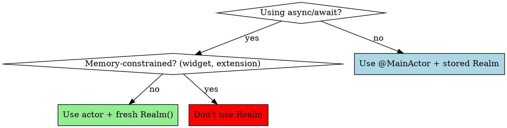

# Realm Persistence for iOS

## Overview

**Realm's thread-confinement model conflicts with Swift Concurrency's thread-hopping.** The zero-copy architecture delivers fast reads but causes memory traps in extensions. Wrong patterns cause "accessed from incorrect thread" crashes.

**Core principle:** Fresh Realm per actor method, batch all writes, never pass objects across threads, avoid Realm in memory-constrained contexts.

## Threading Model

### Critical Rule: Thread-Confined Objects

**Realm objects CAN ONLY be accessed on the thread where Realm was created.**



### Pattern 1: Actor + Fresh Realm (Async/Await)

**CRITICAL:** With async/await, tasks can resume on ANY thread. Stored Realm instance = crash.

```swift
// ❌ WRONG: Stored Realm with async
class TaskManager {
    let realm: Realm  // Created on Thread A

    async func fetchTasks() -> [Task] {
        // May execute on Thread B after suspension
        return Array(realm.objects(Task.self))  // CRASH: incorrect thread
    }
}

// ✅ CORRECT: Fresh Realm per method
actor TaskManager {
    func fetchTasks() async throws -> [Task] {
        let realm = try Realm()  // New Realm on actor's thread
        return Array(realm.objects(Task.self))
    }

    func updateTask(_ id: String, completed: Bool) async throws {
        let realm = try Realm()  // Fresh instance, same actor thread
        guard let task = realm.object(ofType: Task.self, forPrimaryKey: id) else {
            return
        }
        try realm.write {
            task.isCompleted = completed
        }
    }
}
```

**Why this works:**
- Actor executes all methods on single serial queue
- Fresh `Realm()` created on actor's thread each time
- No cross-thread access (Realm dies when method returns)
- Creating Realm is cheap (internal caching makes it fast)

**Key insight:** `try Realm()` looks expensive but is optimized. Realm caches file handles internally.

### Pattern 2: @MainActor (UIKit/Simple Apps)

**For:** UIKit apps without heavy background work.

```swift
@MainActor
final class TaskManager {
    private let realm: Realm

    init() throws {
        self.realm = try Realm()  // Main thread only
    }

    func fetchTasks() -> [Task] {
        Array(realm.objects(Task.self))
    }

    func updateTask(_ id: String, completed: Bool) throws {
        guard let task = realm.object(ofType: Task.self, forPrimaryKey: id) else {
            return
        }
        try realm.write {
            task.isCompleted = completed
        }
    }
}
```

**Trade-off:** All operations block main thread. Good for small datasets (<1000 objects).

### Pattern 3: Background Thread with Autorelease Pool

**CRITICAL:** Background threads MUST wrap Realm in autorelease pool or leak memory.

```swift
// ❌ WRONG: Memory leak on background thread
DispatchQueue.global().async {
    let realm = try! Realm()
    try! realm.write {
        realm.add(item)
    }
    // Realm objects leak without autorelease pool
}

// ✅ CORRECT: Explicit autorelease pool
DispatchQueue.global().async {
    autoreleasepool {
        let realm = try! Realm()
        try! realm.write {
            realm.add(item)
        }
    }
}
```

**Why:** Realm uses Objective-C runtime. Background threads don't have default autorelease pools.

## Performance Patterns

### Pattern 1: Batch Writes

**Problem:** Many small transactions kill performance (each has BEGIN/COMMIT overhead).

```swift
// ❌ WRONG: 1000 transactions = 5-10 seconds
func syncItems(_ items: [ItemDTO]) {
    for item in items {
        try! realm.write {
            realm.add(Item(from: item), update: .modified)
        }
    }
}

// ✅ CORRECT: 1 transaction = 100-300ms
func syncItems(_ items: [ItemDTO]) {
    try! realm.write {
        for item in items {
            realm.add(Item(from: item), update: .modified)
        }
    }
}
```

**Rule:** Batch all writes in a single transaction whenever possible.

### Pattern 2: Background Sync with Progress

**For:** Large syncs (1000+ items) that would block UI.

```swift
actor SyncManager {
    func syncItems(
        _ items: [ItemDTO],
        progress: @escaping (Int, Int) -> Void
    ) async throws {
        let chunkSize = 100
        var synced = 0

        for chunk in items.chunked(into: chunkSize) {
            let realm = try Realm()
            try realm.write {
                for item in chunk {
                    realm.add(Item(from: item), update: .modified)
                }
            }
            synced += chunk.count
            await MainActor.run {
                progress(synced, items.count)
            }
        }
    }
}

// Usage:
Task {
    try await syncManager.syncItems(items) { current, total in
        print("Progress: \(current)/\(total)")
    }
}
```

**Benefits:**
- UI stays responsive
- User sees progress
- Chunks prevent massive memory usage

### Pattern 3: Frozen Objects for Cross-Thread

**Use case:** Pass Realm object to background thread for read-only access.

```swift
actor ImageProcessor {
    func process(user: User) async -> UIImage? {
        // Freeze creates immutable snapshot (thread-safe)
        let frozenUser = user.freeze()

        return await Task.detached {
            // Can access frozenUser on any thread (read-only)
            return generateAvatar(for: frozenUser.name)
        }.value
    }
}
```

**Warning:** Frozen objects are read-only and don't update with writes.

## Codable Integration

### Pattern: DTO (Data Transfer Object)

**Problem:** Realm's `List` type doesn't conform to `Codable`.

```swift
// ❌ WRONG: Trying to make Realm model Codable
@Persisted var tags: List<String>  // List<T> is NOT Codable

// ✅ CORRECT: DTO pattern
struct UserDTO: Codable {
    let id: String
    let name: String
    let tags: [String]  // Standard Array
}

class User: Object {
    @Persisted(primaryKey: true) var id: String
    @Persisted var name: String
    @Persisted var tags: List<String>

    convenience init(from dto: UserDTO) {
        self.init()
        self.id = dto.id
        self.name = dto.name
        self.tags.append(objectsIn: dto.tags)
    }

    func toDTO() -> UserDTO {
        UserDTO(id: id, name: name, tags: Array(tags))
    }
}

// Usage:
let dto = try JSONDecoder().decode(UserDTO.self, from: data)
realm.add(User(from: dto))
```

**Rule:** Never make Realm models Codable. Use DTOs for API layer.

## Memory Constraints

### Widget/Extension Trap

**CRITICAL:** Widgets have ~15MB memory limit. Realm can consume this entirely.

```swift
// ❌ WRONG: Realm in widget (often crashes OOM)
struct TaskWidget: Widget {
    var body: some WidgetConfiguration {
        StaticConfiguration(kind: "TaskWidget") { entry in
            TaskWidgetView(tasks: try! Realm().objects(Task.self))
        }
    }
}

// ✅ CORRECT: UserDefaults or App Groups for widgets
struct TaskWidget: Widget {
    var body: some WidgetConfiguration {
        StaticConfiguration(kind: "TaskWidget") { entry in
            TaskWidgetView(tasks: SharedData.loadTasks())
        }
    }
}

struct SharedData {
    static func loadTasks() -> [TaskDTO] {
        guard let data = UserDefaults(suiteName: "group.app")?.data(forKey: "tasks") else {
            return []
        }
        return (try? JSONDecoder().decode([TaskDTO].self, from: data)) ?? []
    }
}
```

**Rule:** Never use Realm in widgets or extensions. Use lightweight storage (UserDefaults, JSON files).

## Common Mistakes

| Mistake | Reality | Fix |
|---------|---------|-----|
| "Creating Realm() each time is slow" | Realm caches internally. It's fast. | Use fresh Realm per method in actors |
| "I can store Realm in property with async" | Async hops threads. Stored Realm crashes. | Fresh Realm() per call |
| "I don't need autorelease pool" | Background threads leak memory without it | Wrap in `autoreleasepool {}` |
| "Frozen objects update live" | Frozen = immutable snapshot | Use for cross-thread reads only |
| "Realm works fine in widgets" | 15MB limit. Realm uses 10-15MB. | Use UserDefaults/JSON instead |
| "Many small writes are fine" | Each transaction has overhead | Batch in single `realm.write {}` |
| "ThreadSafeReference for everything" | Expensive. Querying by ID often faster. | Pass IDs, fetch on destination thread |

## Framework Comparison

| Feature | Realm | CoreData | SwiftData |
|---------|-------|----------|-----------|
| Threading | Thread-confined | Context per thread | Thread-safe |
| Async/await | Needs actors | Works | Native support |
| Performance (reads) | Fastest (zero-copy) | Medium | Slowest |
| Performance (writes) | Fast | Fastest | Slow |
| Memory usage | High (15MB+) | Medium | Low |
| Cross-platform | ✅ Yes | ❌ No | ❌ No |
| Widget support | ❌ No (OOM) | ✅ Yes | ✅ Yes |
| iCloud sync | Realm Sync | CloudKit | Built-in |

**Choose Realm when:**
- Cross-platform (iOS + Android)
- Fast reads critical (feed, search)
- Real-time sync via Realm Sync service
- NOT using widgets/extensions

**Avoid Realm when:**
- Widget/extension support needed
- Tight memory constraints (<30MB)
- Heavy Swift Concurrency usage (actors add complexity)

## Migration Patterns

### Lightweight Migration

```swift
let config = Realm.Configuration(
    schemaVersion: 2,
    migrationBlock: { migration, oldVersion in
        if oldVersion < 2 {
            // Add new property (automatic)
            // Realm assigns default values
        }
    }
)
Realm.Configuration.defaultConfiguration = config
```

### Complex Migration

```swift
let config = Realm.Configuration(
    schemaVersion: 3,
    migrationBlock: { migration, oldVersion in
        if oldVersion < 3 {
            migration.enumerateObjects(ofType: User.className()) { old, new in
                // Rename property
                new!["fullName"] = old!["firstName"]
            }
        }
    }
)
```

**Rule:** Test migrations with production data backup. Main thread blocks during migration.

## Quick Reference

**Actor pattern:**
```swift
actor RealmManager {
    func fetch() async throws -> [Item] {
        let realm = try Realm()
        return Array(realm.objects(Item.self))
    }

    func write(_ item: Item) async throws {
        let realm = try Realm()
        try realm.write {
            realm.add(item, update: .modified)
        }
    }
}
```

**Batch writes:**
```swift
try realm.write {
    items.forEach { realm.add($0, update: .modified) }
}
```

**DTO pattern:**
```swift
struct DTO: Codable { /* Standard types */ }
class Model: Object {
    init(from dto: DTO) { /* Convert */ }
    func toDTO() -> DTO { /* Convert */ }
}
```

## Red Flags - STOP and Reconsider

- Storing Realm in property with `async` methods → Use actor + fresh Realm()
- 100+ write transactions in loop → Batch in single transaction
- Realm in widget crashing → Switch to UserDefaults/JSON
- Memory leaks on background threads → Add `autoreleasepool`
- "Accessed from incorrect thread" crash → Check async/await usage
- Creating thousands of DTOs for reads → Consider frozen objects
- Migration freezing app → Use `asyncOpen()`

## Real-World Impact

**Before:** Widget crashes on launch (OOM). Realm uses 15MB of 15MB limit.

**After:** UserDefaults with Codable DTOs. Widget uses 2MB, zero crashes.

---

**Before:** Sync 1000 items = 8 second freeze (1000 transactions on main thread).

**After:** Background actor + batched write. Sync in 200ms, UI responsive throughout.
