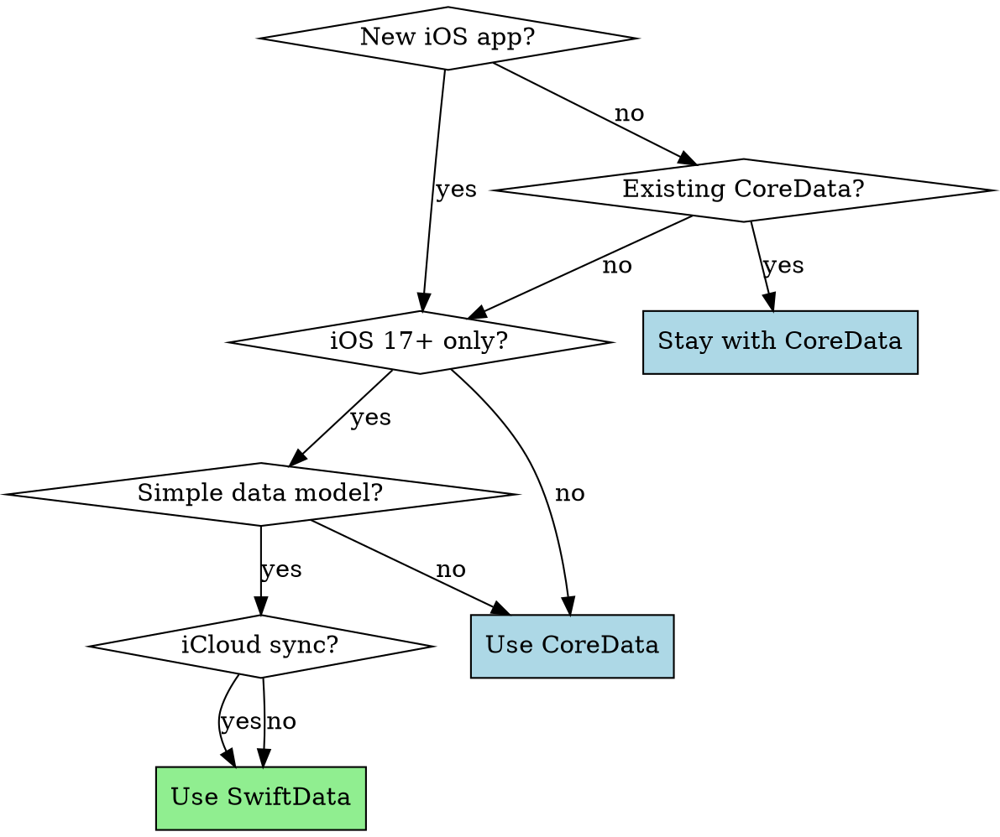

# SwiftData & CoreData Persistence

## Overview

**SwiftData and CoreData are NOT interchangeable.** Each has specific strengths, migration traps, and performance patterns. Wrong framework choice or migration strategy causes production crashes.

**Core principle:** Choose framework based on app constraints, version models from day one, never store BLOBs in the database.

## Framework Selection



### Choose SwiftData When

- **New app**, iOS 17+ deployment target
- **Simple relationships** (mostly 1:1 or 1:N, few complex queries)
- **SwiftUI-first** architecture
- **iCloud sync** needed with minimal configuration

### Choose CoreData When

- **iOS 16 or earlier** support required
- **Complex queries** with NSCompoundPredicate, subqueries
- **UIKit-heavy** app with NSFetchedResultsController
- **Existing CoreData** codebase (migration complex, stay with CoreData)
- **Performance critical** (as of 2025, CoreData still faster)
- **Abstract entities** or inheritance hierarchies

## Migration Death Traps

### Trap 1: Unversioned → Versioned with iCloud

**CRITICAL:** If you shipped unversioned SwiftData with iCloud sync, users will crash on first migration.

**Error:** "Cannot use staged migration with an unknown model version"

**Why:** CloudKit requires versioned schemas for sync consistency.

**Solution:**
```swift
// ❌ WRONG: Adding versioning after shipping unversioned + iCloud
// This will crash for all existing users

// ✅ CORRECT: Two-phase migration
// Version 1.1: Add versioning WITHOUT schema changes
enum SchemaV1: VersionedSchema {
    static var models: [any PersistentModel.Type] { [User.self] }

    @Model
    final class User {
        var name: String
        var email: String
        // EXACT same schema as shipped v1.0
    }
}

// Version 1.2: Now safe to add new properties
enum SchemaV2: VersionedSchema {
    static var models: [any PersistentModel.Type] { [User.self] }

    @Model
    final class User {
        var name: String
        var email: String
        var createdAt: Date? // New property
    }
}
```

**Rule:** Start with versioned schemas from day one, or ship versioning wrapper first.

### Trap 2: Unique Constraint with Duplicates

**Scenario:** Adding `@Attribute(.unique)` when data has duplicates.

**Result:** Lightweight migration fails, app becomes non-functional.

**Solution:** Complex migration with deduplication BEFORE applying constraint.

```swift
struct DeduplicateThenUnique: MigrationStage {
    func migrate(context: ModelContext) throws {
        let items = try context.fetch(FetchDescriptor<OldSchema.Product>())
        let grouped = Dictionary(grouping: items, by: { $0.sku })

        // Keep first, delete duplicates
        for (_, duplicates) in grouped where duplicates.count > 1 {
            for item in duplicates.dropFirst() {
                context.delete(item)
            }
        }
        try context.save()
    }
}
```

**Rule:** Clean data BEFORE applying constraints. Test with production data backup.

### Trap 3: iCloud Sync Blocks Migrations

**CRITICAL:** Once iCloud sync enabled, SwiftData blocks migrations that break lightweight compatibility.

**What this means:**
- Cannot rename properties (breaks sync)
- Cannot change relationship delete rules (breaks sync)
- Cannot remove required properties (breaks sync)

**Workaround:**
```swift
// Instead of renaming (blocked):
// @Model class User {
//     var userName: String // Renamed from 'name'
// }

// Add new, deprecate old (allowed):
@Model class User {
    var name: String // Keep for backward compatibility
    var userName: String? // New preferred field

    var displayName: String {
        userName ?? name // Compute from both
    }
}
```

**Rule:** With iCloud, only additive changes allowed. Design schema carefully upfront.

### Trap 4: Main Thread Migration Blocking

**Symptom:** White screen for 3-5 seconds on app launch after update.

**Cause:** Large dataset migration runs on main thread.

**Solution:** Background initialization.

```swift
// ✅ Initialize container on background thread
Task.detached {
    let container = try await ModelContainer(
        for: User.self,
        migrationPlan: MigrationPlan.self
    )
    await MainActor.run {
        self.container = container
    }
}
```

**Rule:** Always test migrations with realistic data size (1000+ records).

## Performance Patterns

### Pattern 1: Batch Fetching

**Problem:** Loading 1000+ objects at once consumes memory, blocks UI.

**Solution:** fetchBatchSize for lazy loading.

```swift
// ❌ WRONG: Loads all 1000 posts into memory
let request: NSFetchRequest<Post> = Post.fetchRequest()
let posts = try context.fetch(request)

// ✅ CORRECT: Loads 20 at a time as needed
let request: NSFetchRequest<Post> = Post.fetchRequest()
request.fetchBatchSize = 20
let posts = try context.fetch(request)
```

**Rule:** Always set fetchBatchSize for feeds, lists, paginated views.

### Pattern 2: BLOB Storage

**Problem:** Storing images/videos in CoreData/SwiftData kills performance.

**Rule:**
- **< 100KB**: Store inline (safe)
- **100KB - 1MB**: Separate entity with relationship
- **> 1MB**: File system + store path in database

```swift
// ❌ WRONG: 2MB images in Post entity
@Model
class Post {
    var title: String
    @Attribute(.externalStorage) var image: Data // Still loads eagerly!
}

// ✅ CORRECT: File system storage
@Model
class Post {
    var title: String
    var imagePath: String? // "images/post-123.jpg"
}

// Load image on-demand
func loadImage(for post: Post) -> UIImage? {
    guard let path = post.imagePath else { return nil }
    let url = FileManager.documentsDirectory.appendingPathComponent(path)
    return UIImage(contentsOfFile: url.path)
}
```

**Why:** Database fetches load full objects. BLOBs inflate memory usage even when not displayed.

### Pattern 3: Faulting for Relationships

**Problem:** Fetching posts eagerly loads all related users and images.

**Solution:** Return faults, load on access.

```swift
// ✅ Relationships default to faults (good)
let request: NSFetchRequest<Post> = Post.fetchRequest()
request.relationshipKeyPathsForPrefetching = [] // Don't prefetch
let posts = try context.fetch(request)

// Access triggers individual fault:
let authorName = posts[0].author.name // Only now loads User

// ✅ Prefetch when you know you'll need it:
request.relationshipKeyPathsForPrefetching = ["author"]
```

**Rule:** Only prefetch relationships you'll access for ALL fetched objects.

### Pattern 4: NSFetchedResultsController (CoreData)

**For:** Table/collection views with live updates.

**Why:** Lazy loads, automatic UI updates, sectioning built-in.

```swift
let request: NSFetchRequest<Post> = Post.fetchRequest()
request.sortDescriptors = [NSSortDescriptor(key: "createdAt", ascending: false)]
request.fetchBatchSize = 20

let frc = NSFetchedResultsController(
    fetchRequest: request,
    managedObjectContext: context,
    sectionNameKeyPath: nil,
    cacheName: "PostsCache"
)

frc.delegate = self
try frc.performFetch()

// UITableView uses frc.fetchedObjects
```

**Rule:** Use FRC for all CoreData-backed table/collection views.

## SwiftData Limitations (as of iOS 18)

| Feature | CoreData | SwiftData | Workaround |
|---------|----------|-----------|------------|
| NSCompoundPredicate | ✅ | ❌ | Multiple queries |
| NSFetchedResultsController | ✅ | ❌ | @Query in SwiftUI |
| Abstract entities | ✅ | ❌ | Use protocols |
| Child contexts | ✅ | ❌ | Use ModelContext |
| Subclassing models | ✅ | ❌ | Don't subclass |
| Performance | Faster | Slower | Wait for updates |

## Common Mistakes

| Mistake | Reality | Fix |
|---------|---------|-----|
| "Migrations are automatic" | Only lightweight migrations. Unique constraints, renames require complex migrations. | Test with production data |
| "I'll version later" | Unversioned + iCloud = crash on first migration | Version from day one |
| "SwiftData = CoreData simplified" | SwiftData has different rules (no subclassing, different delete rules) | Learn SwiftData-specific constraints |
| "externalStorage attribute fixes BLOBs" | Still loaded into memory on fetch | Store in file system |
| "I can rename properties freely" | With iCloud, renames blocked | Add new property, keep old |
| "Migration won't block UI" | Large datasets block main thread | Background initialization |

## Migration Checklist

**Before shipping schema change:**
- [ ] Defined versioned schemas (V1, V2)
- [ ] Written migration stage if complex (deduplication, renames)
- [ ] Tested with production data backup (1000+ records)
- [ ] Tested migration on background thread (no white screen)
- [ ] Verified iCloud sync works post-migration
- [ ] Checked new properties have defaults or are optional
- [ ] Confirmed unique constraints applied to clean data only

## Quick Reference

**SwiftData:**
```swift
// Basic model
@Model
class User {
    @Attribute(.unique) var email: String
    var name: String
    @Relationship(deleteRule: .cascade) var posts: [Post]
}

// Versioned schemas
enum SchemaV1: VersionedSchema {
    static var models: [any PersistentModel.Type] { [User.self] }
    @Model final class User { /* ... */ }
}

// Query (SwiftUI)
@Query(sort: \.createdAt, order: .reverse) var users: [User]
```

**CoreData:**
```swift
// Fetch with batching
let request: NSFetchRequest<User> = User.fetchRequest()
request.fetchBatchSize = 20
request.predicate = NSPredicate(format: "name CONTAINS[cd] %@", searchText)

// Background context
let bgContext = container.newBackgroundContext()
bgContext.perform {
    // Heavy work here
    try? bgContext.save()
}
```

## Red Flags - STOP and Reconsider

- Shipped unversioned schema with iCloud → Ship versioning wrapper first
- Adding unique constraint to dirty data → Run deduplication migration
- Storing multi-MB files in database → Move to file system
- White screen on launch after update → Background migration
- Fetch taking >500ms → Add fetchBatchSize, check for BLOBs
- "I'll handle migration when users complain" → Test NOW with production data

## Real-World Impact

**Before:** App crashes for 100% of users with iCloud enabled after first migration (unversioned→versioned trap).

**After:** Ship v1.1 with versioning wrapper (no schema change), then v1.2 with actual changes. Zero crashes.

---

**Before:** Feed loads in 4 seconds with 1000 posts + 2MB images each.

**After:** Images moved to file system, fetchBatchSize = 20. Feed loads in 300ms, lazy-loads images.
