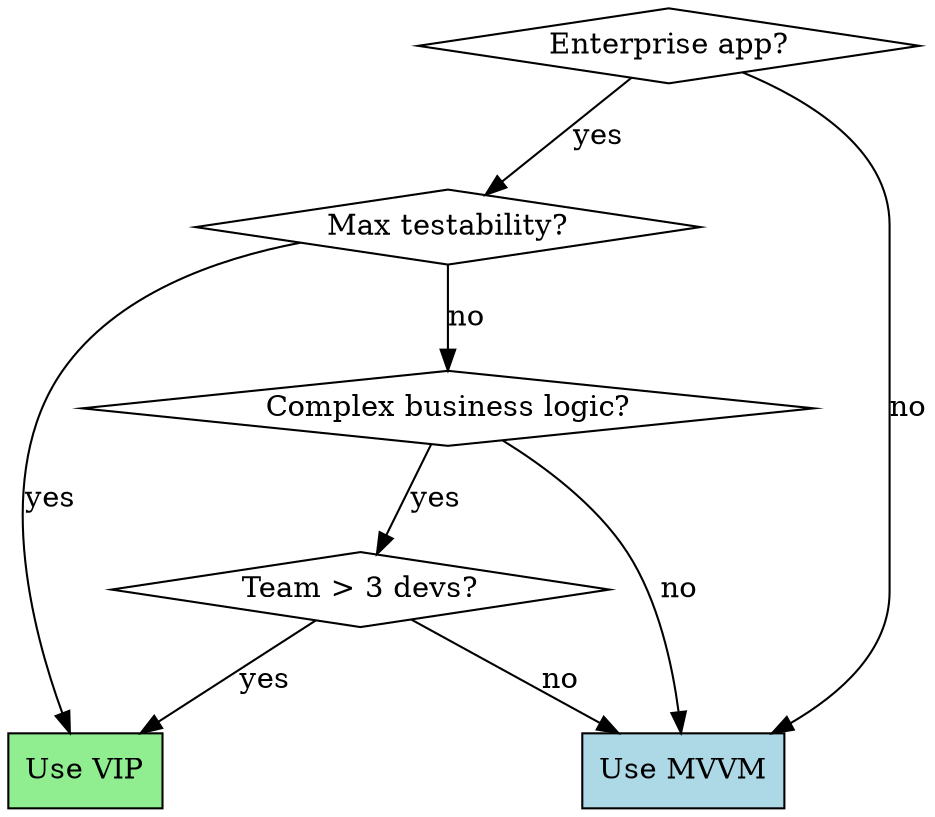

# VIP Clean Architecture

## Overview

VIP (View-Interactor-Presenter) is Uncle Bob's Clean Architecture applied to iOS with **strict unidirectional data flow**. Unlike MVVM (bidirectional) or VIPER (complex 5-component), VIP uses **3 core components** with protocol-based boundaries.

**Core Principle:** Data flows in one direction: View → Interactor → Presenter → View. No component ever calls backward in the cycle.

## When to Use VIP



**Use VIP for:**
- Enterprise iOS apps with strict quality requirements
- Features requiring 80%+ test coverage
- Complex business logic with multiple edge cases
- Multi-team projects needing clear boundaries
- Apps where testability > development speed

**Use MVVM instead for:**
- Standard iOS apps (most apps)
- Rapid prototyping or MVPs
- Simple CRUD applications
- Small teams (1-2 developers)
- Projects prioritizing delivery speed

## VIP Components

| Component | Responsibility | Testability | What It Must NOT Do |
|-----------|---------------|-------------|---------------------|
| **View** | Display, user input, lifecycle events | UI tests only | Business logic, formatting, navigation |
| **Interactor** | Business logic, use cases, orchestration | 100% unit testable | UI updates, data formatting, navigation |
| **Presenter** | Format data for display, prepare view models | 100% unit testable | Business logic, network calls, persistence |
| **Worker** | External services (network, DB, APIs) | Mock/stub in tests | Business logic, data formatting |
| **Router** | Navigation, screen transitions | Integration tests | Business logic, data management |

## VIP Data Flow (Critical)

**Rule:** Data flows in ONE direction only. Never call backward in the cycle.

```
User Action → View → Interactor → Presenter → View
                ↑                              ↓
                └──────── Display ─────────────┘
```

**Detailed Flow:**
1. **View** captures user action → calls `Interactor.doSomething(request: Request)`
2. **Interactor** executes business logic → calls `Presenter.presentSomething(response: Response)`
3. **Presenter** formats data → calls `View.displaySomething(viewModel: ViewModel)`
4. **View** updates UI with formatted data

**Example: Login Flow**

```
User taps "Login" button
→ View calls interactor.login(request: LoginRequest(email: "...", password: "..."))
→ Interactor validates input, calls Worker.authenticate(...)
→ Worker makes API call, returns Result<User, Error>
→ Interactor processes result, calls presenter.presentLoginResult(response: LoginResponse.success(user))
→ Presenter formats: "Welcome, John!" → calls view.displayWelcome(viewModel: LoginViewModel.success(message: "Welcome, John!"))
→ View updates UILabel.text = "Welcome, John!"
```

## Protocol-Based Communication

**Critical Rule:** All components communicate via protocols, never concrete types.

```swift
// MARK: - Protocols (VIP Cycle)

protocol LoginBusinessLogic {
    func login(request: LoginRequest)
}

protocol LoginPresentationLogic {
    func presentLoginResult(response: LoginResponse)
}

protocol LoginDisplayLogic: AnyObject {
    func displayWelcome(viewModel: LoginViewModel)
    func displayError(viewModel: LoginViewModel)
}

// MARK: - Data Models (Request → Response → ViewModel)

struct LoginRequest {
    let email: String
    let password: String
}

enum LoginResponse {
    case success(user: User)
    case failure(error: Error)
}

enum LoginViewModel {
    case success(message: String)
    case error(title: String, message: String)
}

// MARK: - View

final class LoginViewController: UIViewController {
    var interactor: LoginBusinessLogic?
    var router: LoginRoutingLogic?

    @IBAction func loginButtonTapped() {
        let request = LoginRequest(
            email: emailTextField.text ?? "",
            password: passwordTextField.text ?? ""
        )
        interactor?.login(request: request)
    }
}

extension LoginViewController: LoginDisplayLogic {
    func displayWelcome(viewModel: LoginViewModel) {
        guard case .success(let message) = viewModel else { return }
        welcomeLabel.text = message
        router?.routeToHome()
    }

    func displayError(viewModel: LoginViewModel) {
        guard case .error(let title, let message) = viewModel else { return }
        showAlert(title: title, message: message)
    }
}

// MARK: - Interactor

final class LoginInteractor: LoginBusinessLogic {
    var presenter: LoginPresentationLogic?
    var worker: LoginWorkerProtocol?

    func login(request: LoginRequest) {
        // Validation (business logic)
        guard !request.email.isEmpty, !request.password.isEmpty else {
            presenter?.presentLoginResult(response: .failure(error: ValidationError.emptyFields))
            return
        }

        // Delegate to Worker for external service
        worker?.authenticate(email: request.email, password: request.password) { [weak self] result in
            switch result {
            case .success(let user):
                self?.presenter?.presentLoginResult(response: .success(user: user))
            case .failure(let error):
                self?.presenter?.presentLoginResult(response: .failure(error: error))
            }
        }
    }
}

// MARK: - Presenter

final class LoginPresenter: LoginPresentationLogic {
    weak var viewController: LoginDisplayLogic?

    func presentLoginResult(response: LoginResponse) {
        switch response {
        case .success(let user):
            let viewModel = LoginViewModel.success(message: "Welcome, \(user.name)!")
            viewController?.displayWelcome(viewModel: viewModel)

        case .failure(let error):
            let viewModel = LoginViewModel.error(
                title: "Login Failed",
                message: error.localizedDescription
            )
            viewController?.displayError(viewModel: viewModel)
        }
    }
}

// MARK: - Worker

protocol LoginWorkerProtocol {
    func authenticate(email: String, password: String, completion: @escaping (Result<User, Error>) -> Void)
}

final class LoginWorker: LoginWorkerProtocol {
    func authenticate(email: String, password: String, completion: @escaping (Result<User, Error>) -> Void) {
        // Network call, Core Data fetch, or external API
        APIClient.shared.login(email: email, password: password, completion: completion)
    }
}
```

## VIP Testing Strategy (Spy Pattern)

**Critical Rule:** Use Spy objects to verify protocol method calls, not XCTest assertions on properties.

### Why Spies over Mocks?

- **Spies record calls:** Verify that correct methods were called with correct parameters
- **Mocks return data:** Provide predetermined responses for testing
- **VIP needs Spies:** We test protocol contracts, not implementation details

### Testing the Interactor

```swift
final class LoginInteractorTests: XCTestCase {
    var sut: LoginInteractor!
    var presenterSpy: LoginPresenterSpy!
    var workerSpy: LoginWorkerSpy!

    override func setUp() {
        super.setUp()
        sut = LoginInteractor()
        presenterSpy = LoginPresenterSpy()
        workerSpy = LoginWorkerSpy()
        sut.presenter = presenterSpy
        sut.worker = workerSpy
    }

    func testLoginWithValidCredentialsCallsWorker() {
        // Given
        let request = LoginRequest(email: "test@example.com", password: "password123")

        // When
        sut.login(request: request)

        // Then
        XCTAssertTrue(workerSpy.authenticateCalled)
        XCTAssertEqual(workerSpy.authenticateEmail, "test@example.com")
        XCTAssertEqual(workerSpy.authenticatePassword, "password123")
    }

    func testLoginWithEmptyEmailPresentsError() {
        // Given
        let request = LoginRequest(email: "", password: "password123")

        // When
        sut.login(request: request)

        // Then
        XCTAssertTrue(presenterSpy.presentLoginResultCalled)
        if case .failure(let error) = presenterSpy.presentLoginResultResponse {
            XCTAssertTrue(error is ValidationError)
        } else {
            XCTFail("Expected failure response")
        }
    }
}

// MARK: - Presenter Spy

final class LoginPresenterSpy: LoginPresentationLogic {
    var presentLoginResultCalled = false
    var presentLoginResultResponse: LoginResponse?

    func presentLoginResult(response: LoginResponse) {
        presentLoginResultCalled = true
        presentLoginResultResponse = response
    }
}

// MARK: - Worker Spy

final class LoginWorkerSpy: LoginWorkerProtocol {
    var authenticateCalled = false
    var authenticateEmail: String?
    var authenticatePassword: String?
    var authenticateResult: Result<User, Error> = .success(User(id: "1", name: "Test User"))

    func authenticate(email: String, password: String, completion: @escaping (Result<User, Error>) -> Void) {
        authenticateCalled = true
        authenticateEmail = email
        authenticatePassword = password
        completion(authenticateResult)
    }
}
```

### Testing the Presenter

```swift
final class LoginPresenterTests: XCTestCase {
    var sut: LoginPresenter!
    var viewControllerSpy: LoginViewControllerSpy!

    override func setUp() {
        super.setUp()
        sut = LoginPresenter()
        viewControllerSpy = LoginViewControllerSpy()
        sut.viewController = viewControllerSpy
    }

    func testPresentLoginSuccessFormatsWelcomeMessage() {
        // Given
        let user = User(id: "1", name: "John Doe")
        let response = LoginResponse.success(user: user)

        // When
        sut.presentLoginResult(response: response)

        // Then
        XCTAssertTrue(viewControllerSpy.displayWelcomeCalled)
        if case .success(let message) = viewControllerSpy.displayWelcomeViewModel {
            XCTAssertEqual(message, "Welcome, John Doe!")
        } else {
            XCTFail("Expected success viewModel")
        }
    }

    func testPresentLoginFailureFormatsErrorMessage() {
        // Given
        let error = NSError(domain: "Test", code: 401, userInfo: [NSLocalizedDescriptionKey: "Invalid credentials"])
        let response = LoginResponse.failure(error: error)

        // When
        sut.presentLoginResult(response: response)

        // Then
        XCTAssertTrue(viewControllerSpy.displayErrorCalled)
        if case .error(let title, let message) = viewControllerSpy.displayErrorViewModel {
            XCTAssertEqual(title, "Login Failed")
            XCTAssertEqual(message, "Invalid credentials")
        } else {
            XCTFail("Expected error viewModel")
        }
    }
}

// MARK: - View Spy

final class LoginViewControllerSpy: LoginDisplayLogic {
    var displayWelcomeCalled = false
    var displayWelcomeViewModel: LoginViewModel?

    var displayErrorCalled = false
    var displayErrorViewModel: LoginViewModel?

    func displayWelcome(viewModel: LoginViewModel) {
        displayWelcomeCalled = true
        displayWelcomeViewModel = viewModel
    }

    func displayError(viewModel: LoginViewModel) {
        displayErrorCalled = true
        displayErrorViewModel = viewModel
    }
}
```

## Critical Rules

### ✅ DO

- **Protocol everything:** All component communication via protocols
- **Unidirectional flow:** View → Interactor → Presenter → View (never backward)
- **Three data models:** Request (View→Interactor), Response (Interactor→Presenter), ViewModel (Presenter→View)
- **Spy-based tests:** Verify protocol method calls, not property assertions
- **Worker isolation:** All external services (network, DB, location) in Workers
- **Presenter formats only:** Strings, dates, colors, numbers prepared for display

### ❌ DON'T

- **Never skip the cycle:** View must NOT call Presenter directly
- **Never call backward:** Presenter must NOT call Interactor
- **Never mix ViewModels:** VIP uses Presenter, not ViewModel classes
- **Never use concrete types:** Always depend on protocols
- **Never put business logic in Presenter:** Business logic belongs in Interactor
- **Never put formatting in Interactor:** Formatting belongs in Presenter

## Anti-Patterns to Reject

| Anti-Pattern | Why It's Wrong | Correct Approach |
|--------------|----------------|------------------|
| View calls Presenter directly | Breaks unidirectional flow, bypasses business logic | View always calls Interactor first |
| Presenter calls Interactor | Creates circular dependency, breaks cycle | Interactor calls Presenter, never reverse |
| Mixing ViewModel with VIP | ViewModel is MVVM concept, VIP uses Presenter | Remove ViewModel, use Presenter for formatting |
| Business logic in Presenter | Presenter should only format, not decide | Move validation/logic to Interactor |
| Interactor updates View | Violates separation, untestable | Interactor → Presenter → View path |
| Using concrete types | Hard to test, tight coupling | All components depend on protocols |

## VIP vs MVVM vs VIPER

| Aspect | VIP | MVVM | VIPER |
|--------|-----|------|-------|
| Components | 3 core (V-I-P) + Worker + Router | 2 (View + ViewModel) | 5 (V-I-P-E-R) |
| Data Flow | Unidirectional cycle | Bidirectional binding | Multi-directional |
| Testability | 100% (protocol-based Spies) | High (mock services) | 100% (protocol-based) |
| Complexity | Medium | Low | High |
| Best For | Enterprise apps, max testability | Most iOS apps | Complex multi-module apps |

## Scene Assembly (Dependency Injection)

**Configurator Pattern:**

```swift
final class LoginConfigurator {
    static func configure(_ viewController: LoginViewController) {
        let interactor = LoginInteractor()
        let presenter = LoginPresenter()
        let router = LoginRouter()
        let worker = LoginWorker()

        viewController.interactor = interactor
        viewController.router = router
        interactor.presenter = presenter
        interactor.worker = worker
        presenter.viewController = viewController
        router.viewController = viewController
    }
}

// Usage in AppDelegate or SceneDelegate
let loginVC = LoginViewController()
LoginConfigurator.configure(loginVC)
present(loginVC, animated: true)
```

## Migration from MVVM to VIP

**Step 1:** Identify the ViewModel
```swift
// Before (MVVM)
class LoginViewModel: ObservableObject {
    @Published var email = ""
    @Published var password = ""

    func login() async {
        // Business logic + formatting mixed
    }
}
```

**Step 2:** Split into Interactor (business logic) + Presenter (formatting)
```swift
// After (VIP)

// Interactor: Business logic only
class LoginInteractor: LoginBusinessLogic {
    func login(request: LoginRequest) {
        // Validation logic
        // Call Worker
        // Pass raw response to Presenter
    }
}

// Presenter: Formatting only
class LoginPresenter: LoginPresentationLogic {
    func presentLoginResult(response: LoginResponse) {
        // Format user.name into "Welcome, John!"
        // Create ViewModel with formatted strings
    }
}
```

**Step 3:** Add protocol boundaries
```swift
protocol LoginBusinessLogic { ... }
protocol LoginPresentationLogic { ... }
protocol LoginDisplayLogic: AnyObject { ... }
```

**Step 4:** Implement Spy-based tests
```swift
class LoginPresenterSpy: LoginPresentationLogic { ... }
class LoginWorkerSpy: LoginWorkerProtocol { ... }
```

## References

- **Clean Architecture (Uncle Bob):** https://blog.cleancoder.com/uncle-bob/2012/08/13/the-clean-architecture.html
- **Clean Swift (VIP Creator):** https://clean-swift.com/clean-swift-ios-architecture/
- **VIP vs VIPER:** https://clean-swift.com/viper-vs-vip/

---

**Word count:** ~2,100
**For:** Senior iOS engineers building enterprise apps
**Focus:** Unidirectional flow, protocol-based testability, Spy pattern
