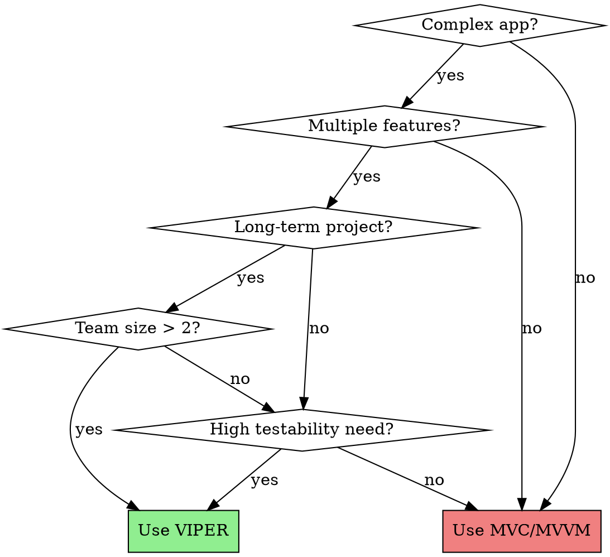

# VIPER Architecture (Rambler Team)

## Overview

VIPER enforces Single Responsibility Principle through five protocol-based components: **View**, **Interactor**, **Presenter**, **Entity**, **Router**. Created and documented by Rambler&Co iOS Team.

**Core Principle**: Entities never reach the Presentation layer. Simple data structures transfer between Interactor and Presenter, preventing business logic pollution in UI.

## When to Use VIPER



**Use VIPER for:**
- Multi-feature apps (authentication, payments, user profiles, etc.)
- Long-term projects (6+ months)
- Teams with 3+ developers
- Apps requiring extensive unit test coverage
- Multi-platform code sharing (iOS/iPadOS/macOS)

**Avoid VIPER for:**
- Single-screen utilities
- Rapid prototypes with unclear requirements
- Weekend projects or proof-of-concepts
- Small teams with tight deadlines

## Component Responsibilities

| Component | Responsibility | What It Must NOT Do |
|-----------|---------------|---------------------|
| **View** | Display content, relay user input (passive) | Request data, format data, navigation, business logic |
| **Interactor** | Business logic, use cases (platform-independent) | UI updates, formatting, routing, direct Core Data access |
| **Presenter** | View logic, data formatting (bridges logic & display) | Business logic, network calls, data persistence |
| **Entity** | Plain model objects (PONSOs - no behavior) | Logic, formatting, self-persistence |
| **Router** | Navigation, module assembly | Business logic, data management, UI updates |

## VIPER Data Flow

**Critical Rule**: Entities never pass to Presentation layer.

```
User Action → View → Presenter → Interactor → Entity/DataStore
           ↓
      Display ← Presenter ← Simple Data ← Interactor
```

**Example: Weather Feature**

```
User taps refresh
→ View calls presenter.didTapRefresh()
→ Presenter calls interactor.refreshWeather()
→ Interactor fetches from DataManager/API
→ Interactor validates, transforms Entity to simple WeatherData
→ Interactor calls presenter.didReceiveWeather(WeatherData)
→ Presenter formats: "72°F, Sunny"
→ Presenter calls view.display(temperature: "72°F")
→ View updates UILabel
```

**Violations to Reject:**
- ✗ Passing NSManagedObject/Entity to Presenter
- ✗ Presenter accessing Core Data directly
- ✗ Presenter making network calls
- ✗ View calling Interactor directly
- ✗ ViewController instantiating other ViewControllers

## Protocol-Based Communication

**Rambler's ViperMcFlurry Pattern:**

```swift
// Module Input (parent → child communication)
protocol WeatherModuleInput: RamblerViperModuleInput {
    func configureWithLocation(_ location: String)
}

// Module Output (child → parent communication)
protocol WeatherModuleOutput: RamblerViperModuleOutput {
    func weatherModuleDidSelectLocation(_ location: String)
}

// Presenter implements both
class WeatherPresenter: WeatherModuleInput {
    weak var view: WeatherViewInput?
    var interactor: WeatherInteractorInput?
    var router: WeatherRouterInput?
    var moduleOutput: WeatherModuleOutput?

    // From module input
    func configureWithLocation(_ location: String) {
        interactor?.fetchWeather(for: location)
    }
}

// View Protocol
protocol WeatherViewInput: AnyObject {
    func displayTemperature(_ text: String)
    func showLoading()
    func showError(_ message: String)
}

protocol WeatherViewOutput: AnyObject {
    func viewDidLoad()
    func didTapRefresh()
}

// Interactor Protocols
protocol WeatherInteractorInput: AnyObject {
    func fetchWeather(for location: String)
}

protocol WeatherInteractorOutput: AnyObject {
    func didFetchWeather(_ data: WeatherData)
    func didFailWithError(_ error: Error)
}
```

## Rambler Ecosystem Tools

**Generamba** - Code generator for VIPER modules
```bash
gem install generamba
generamba setup
generamba gen WeatherModule rviper_controller
```
Creates consistent module structure with all protocols and classes.

**ViperMcFlurry** - Framework for module assembly
- Provides `RamblerViperModuleInput` and `RamblerViperModuleOutput` base protocols
- Enables factory-based and segue-based module creation
- Handles module configuration through chaining pattern

**Typhoon** - Dependency injection (used in Rambler's three-layer architecture)
- Presentation layer: VIPER
- BusinessLogic layer: Service-Oriented Architecture
- Core layer: Compound operations

## Testing Strategy (TDD-Friendly)

**Order**: Interactor → Presenter → View

**1. Test Interactor First** (pure business logic, no UI):
```swift
func testFetchWeatherRequestsDataFromCorrectLocation() {
    let mockDataManager = MockWeatherDataManager()
    interactor.dataManager = mockDataManager

    interactor.fetchWeather(for: "San Francisco")

    XCTAssertEqual(mockDataManager.requestedLocation, "San Francisco")
}
```

**2. Then Test Presenter** (data formatting):
```swift
func testDidFetchWeatherFormatsTemperatureCorrectly() {
    let mockView = MockWeatherView()
    presenter.view = mockView

    presenter.didFetchWeather(WeatherData(temperature: 20))

    XCTAssertEqual(mockView.displayedTemperature, "68°F")
}
```

**3. Finally Test View** (UI state):
```swift
func testDisplayTemperatureUpdatesLabel() {
    view.displayTemperature("72°F")

    XCTAssertEqual(view.temperatureLabel.text, "72°F")
}
```

## Common Anti-Patterns

| Anti-Pattern | Why It's Wrong | Correct Approach |
|--------------|----------------|------------------|
| Presenter accesses Core Data | Violates layer separation, untestable | Move to Interactor, use DataManager abstraction |
| View calls Interactor directly | Breaks mediation pattern | All communication through Presenter |
| Passing NSManagedObject to Presenter | Entity reaches Presentation layer | Transform to simple struct/PONSO in Interactor |
| ViewController instantiates other VCs | Tight coupling, hard to test navigation | Router handles all navigation |
| Business logic in Presenter | Wrong layer, duplicates testing effort | Move to Interactor |

## Example: Refactoring MVC to VIPER

**Before (MVC - Massive View Controller):**
```swift
class WeatherViewController: UIViewController {
    var weatherService = WeatherAPIService()

    func loadWeather() {
        weatherService.fetchWeather { weather in
            self.temperatureLabel.text = "\(weather.temperature)°"
        }
    }
}
```

**After (VIPER - Proper Separation):**
```swift
// View - Displays only
class WeatherViewController: UIViewController {
    var output: WeatherViewOutput?

    override func viewDidLoad() {
        output?.viewDidLoad()
    }
}

extension WeatherViewController: WeatherViewInput {
    func displayTemperature(_ text: String) {
        temperatureLabel.text = text
    }
}

// Presenter - Formats data
class WeatherPresenter: WeatherViewOutput {
    weak var view: WeatherViewInput?
    var interactor: WeatherInteractorInput?

    func viewDidLoad() {
        interactor?.fetchWeather()
    }

    func didFetchWeather(_ data: WeatherData) {
        let formatted = "\(Int(data.temperature))°F"
        view?.displayTemperature(formatted)
    }
}

// Interactor - Business logic
class WeatherInteractor: WeatherInteractorInput {
    weak var output: WeatherInteractorOutput?
    var dataManager: WeatherDataManager?

    func fetchWeather() {
        dataManager?.fetch { [weak self] result in
            switch result {
            case .success(let weather):
                self?.output?.didFetchWeather(weather)
            case .failure(let error):
                self?.output?.didFailWithError(error)
            }
        }
    }
}
```

## Real-World Impact

**Testability**: Each layer testable in isolation without mocks for adjacent layers
**Maintainability**: Clear boundaries prevent feature creep in components
**Team Scalability**: Multiple developers can work on different modules without conflicts
**Code Reuse**: Interactor logic works on iOS, iPadOS, macOS identically

## References

- **The Book of VIPER**: https://github.com/strongself/The-Book-of-VIPER (Rambler team's complete guide)
- **ViperMcFlurry**: https://github.com/rambler-digital-solutions/ViperMcFlurry (Rambler's VIPER framework)
- **Generamba**: https://github.com/rambler-digital-solutions/Generamba (Code generator)
- **Example App**: https://github.com/rambler-digital-solutions/rambler-it-ios (Open source VIPER app)
- **objc.io Article**: https://www.objc.io/issues/13-architecture/viper/ (Foundational VIPER explanation)
